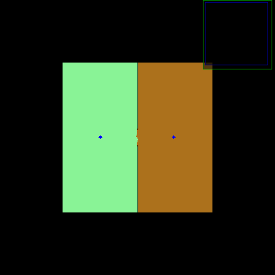

实验结果

map.row=2314 col=2050
createVoronoiGraph take time0.387195
pruneVoronoiGraph take time1.47741
get critical_points2 take time0.105112
get critical_line take time13.1267
Found 279 rooms.
Find the Contours by critical_line take time0.023537
wavefrontRegionGrowing take time2.57805
seg take time17.6992


```
office_g_gt_segmentation.png
```

map.row=2314 col=2050
createVoronoiGraph take time0.257519
pruneVoronoiGraph take time1.28225
get critical_points2 take time0.046021
get critical_line take time3.75935
Found 93 rooms.
Find the Contours by critical_line take time0.004093
wavefrontRegionGrowing take time3.39137
seg take time8.74116


如图



优化前耗时，主要是合并地图花费太多时间

createVoronoiGraph take time0.008548
pruneVoronoiGraph take time0.043509
get critical_points2 take time0.003128
get critical_line take time0.005313
Found 6 rooms.
Find the Contours by critical_line take time0.000265
wavefrontRegionGrowing take time0.024987
collect neighbor IDs take time3.35404
mergeRoomPair take time5.7204
mergeRooms take time9.07446
seg take time9.16032


优化后

createVoronoiGraph take time0.00866
pruneVoronoiGraph take time0.043664
get critical_points2 take time0.003124
get critical_line take time0.00527
Found 6 rooms.
Find the Contours by critical_line take time0.000198
wavefrontRegionGrowing take time0.029376
get edge take time0.06581
mergeRoomPair take time0.000553
mergeRooms take time0.066373
seg take time0.156751

（1）统计这个区域的点的面积和统计相邻的区域花的时间太长，原因为使用全地图遍历统计。优化为找最大外接矩形后在最大外接矩形内统计区域内


