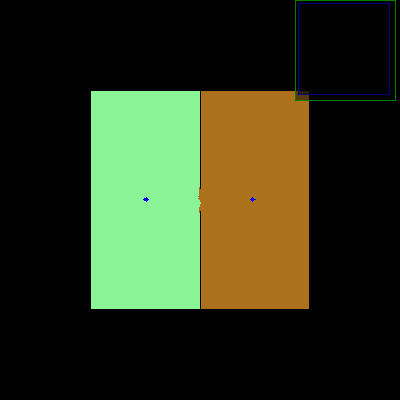

Delaunay三角网是由一个一个的三角形构成的，其中三角形中的每一个顶点都是Voronoi点集中的点。

1、空外接圆性质：在由点集S构成的Delaunay三角网中，每个三角形的外接圆均不包含点集S中的其他任意点，即任何一个Delaunay三角形的外接圆不包含其他任何点。
2、最大的最小角性质：在由点集S所构成的三角网中，Delaunay三角网中三角形的最小角度是最大的，一个简明的解释：2个相邻三角形构成的凸四边形的对角线在相互交换后，6个内角的最小角不再增大。

下面给出**Voronoi图**的定义：

Voronoi图，又叫泰森多边形或Dirichlet图，它是由一组由连接**两邻点**直线的**垂直平分线**组成的连续多边形组成。N个在平面上有区别的点，按照最邻近原则划分平面；每个点与它的最近邻区域相关联。Delaunay三角形是由与相邻Voronoi多边形共享一条边的相关点连接而成的三角形。Delaunay三角形的外接圆圆心是与三角形相关的Voronoi多边形的一个顶点。Voronoi三角形是Delaunay图的偶图；

什么意思呢，我们通过一个例子看一下怎么通过**Delaunay三角网**得到**Voronoi图**


2.维诺图分割步骤

(1)提取轮廓

如下图，轮廓保存在链表中


（2）由轮廓生成维诺图


如图生成的线就是voronoi_facets，就是维诺图

（3）从维诺图中找候选临界点(critical Points)

步骤：1.对于维诺图上的点，如果这个点相邻区域有三个点以上也是维诺图上的点，这个点就是候选临界点。

删除一些明显不是的点


（4）从维诺图中找候选临界点2(critical Points)

对于维诺图上的点，和相邻的维诺图上的点进行对比，在这些点中选出距离障碍物最近的点作为候选临界点。

 


（5）通过角度和距离删除一些临界候选点

对应每个临界点，找这个临界点周围的点，

（a）如果周围的点对应的临界直线夹角比当前临界直线夹角的小，删除当前点

（b）如果夹角角度相同，当前点距离长，并且满足周围的距离大于3就删除当前点


（5）连接临界点生成临界直线

通过求临界点到最近的轮廓距离得到临界直线


（6）提取轮廓


（7）根据临界直线找轮廓生成区域


7.合并区域




合并区域逻辑如下

1)Areas smaller than a threshold (12.5m 2 ) with exactly one neighbor and less than 75% of the border touching
walls (i.e. not a closed room area) become merged with that neighbor.

2) Small regions below a threshold size (2m 2 ) are merged with a surrounding area that is in touch with at least
20% of the small region’s border pixels.
3) Merge regions with (i) exactly one neighbor that has maximal 2 neighbors and with (ii) at least 50% of
the perimeter touching walls (this connects two parts inside the same room).
4) Merge regions that share a significant part of their borders, i.e. at least 20% for the smaller room and 10% for the larger room.
5) Merge regions with more than 40% of their perimeter touching another segment (this often happens near/below tables or other ragged obstacles).


1）根据是否有相邻区域和边界墙的长度决定是否合并。如果面积小于12.5m并且只有一个相邻的区域并且边界墙的长度比例小于75%就合并。

2) 如果面积小于2m的区域选择和边界相邻比率大于20%的区域合并。

3）连接同一个房间的两个部分的情况：这个区域有1到2个邻域并且边界是墙的长度比率大于50%。

4）对于共享很大长度的边界的区域要合并。小区域共享边界至少大于20%，小区域共享边界至少大于10%

5）边界长度大于40%和其他区域相邻要合并（在类似于桌子障碍物周围的区域合并）


```
i
```

注意，合并区域花的时间最长，需要优化


其他定义

基点Site：具有一些几何意义的点

细胞Cell：这个Cell中的任何一个点到Cell中基点中的距离都是**最近**的，离其他Site比离内部Site的距离都要远。

Cell的划分：基点Site与其它的n-1个点所对应的那个平分线所确定的那个离它更近的那个半平面。把所有这些半平面公共的交集求出来**就是这个cell.** 


本地耗时

createVoronoiGraph take time0.014457
pruneVoronoiGraph take time0.271751
get critical_points2 take time0.00854
get critical_line take time0.036134
Found 11 rooms.
Find the Contours by critical_line take time0.000909
wavefrontRegionGrowing take time0.223795
mergeRooms take time2.71849
seg take time3.27426

rk3308耗时

createVoronoiGraph take time0.312682
pruneVoronoiGraph take time4.14463
get critical_points2 take time0.106722
get critical_line take time0.479996
Found 11 rooms.
Find the Contours by critical_line take time0.017153
wavefrontRegionGrowing take time3.3294
mergeRooms take time30.8947
seg take time39.2872

参考文献

https://blog.csdn.net/qq_44339029/article/details/126296997

https://zhuanlan.zhihu.com/p/33896575

德劳内(delaunay)三角网的生成算法 

https://www.bilibili.com/read/cv9358144/

Delaunay三角剖分算法

https://baike.baidu.com/item/Delaunay%E4%B8%89%E8%A7%92%E5%89%96%E5%88%86%E7%AE%97%E6%B3%95?fromModule=lemma_search-box


https://blog.csdn.net/f980511/article/details/90511392/


Learning metric-topological maps for indoor mobile robot navigation

Towards autonomous topological place detection using the extended voronoi graph


